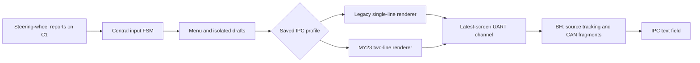

# Menu, MY23 rendering and input contract

This guide describes the MY23 UI candidate. Integration and physical acceptance
are tracked only in [ACTION_PLAN.md](../ACTION_PLAN.md).

**Maintenance:** update both [EN](../../manuals/BACCAble_USER_GUIDE_EN.md) and
[PL](../../manuals/BACCAble_USER_GUIDE_PL.md) user guides whenever menu labels,
structure, gestures, settings, parameters or device operation change. See
[AGENTS.md](../../AGENTS.md#keep-both-user-guides-current).

## Ownership and display profiles

C1 owns menu navigation, drafts, engine filtering and persistence. BH owns IPC
CAN transmission. C2 receives shared board traffic but does not render the menu.
There is no heap allocation in the UI.

`IPC_MY23_IS_INSTALLED` chooses the C1 **default** profile. Saved `MY23 IPC`
can override it. `LARGE_DISPLAY` independently chooses the legacy 18/24-character
width. MY23 always has budgets `MY23_L1_VISIBLE = 14` and
`MY23_L2_VISIBLE = 22`. Those are visible glyph counts, not UTF-8 byte limits.

The main menu remains Favorites, Readings, Actions, Settings, Information.
MY23/atomic Settings contains Features, Favorites, Shown pages, Sort order.
Legacy before its first five-slot save retains Features, Page favorites,
Shown pages, Favorite order, Sort order, Favorites. Existing catalogs, engine gates and page IDs are retained.
The [catalog audit](CATALOG_AUDIT.md) describes the legacy reading model.

## Central button recognizer

`features/menu_input.c` owns all RES/distance timing. `0x50` normalizes to `0x90`.
CC and ACC must both be disabled, with a fresh released report to arm input.

| Input | Timing and behavior |
| --- | --- |
| Click | Released after at least 30 ms; deferred until the double-click window expires |
| Double-click | Two short releases within 280 ms; emits `MENU_BACK`, without an earlier SELECT |
| Hold | 900 ms of continued reports; emits `MENU_HOLD` once, never SELECT on release |
| Third rapid click | Consumed during the 280 ms suppression window after a pair |
| Gentle direction | Immediate peer navigation; repeat after 500 ms, then every 180 ms |
| Strong direction | Functional-group navigation; no repeat |
| Report gap | Over 300 ms cancels the gesture/pending click; a release rearms input |

Polling occurs in `menu_process`, so the final click need not wait for another
button transition. Unsigned elapsed-time comparisons handle tick wrap. Scrolling
cancels a pending pair, and a hold cancels it too. No menu has a private double
click timer. `MENU_SELECT`, `MENU_BACK`, `MENU_HOLD` are the shared semantic events.
A hold opens Favorites when closed. Within the menu, a hold acts only on a shown
SAVE/APPLY/STORE prompt; it is never an invisible alternate navigation command.

## Draft and confirmation ownership

Features and the public `setup_select_page` API share the `setup_stage_*` draft
workflow. Runtime values,
USB modes, pedal maps and board configuration remain unchanged while editing.
Numbers clamp to descriptor bounds; enums move in both directions. Signed trim
is normalized to its persisted byte representation before dirty comparison.
Engine and USB drafts include their companion setting bit.

| State/event | Result |
| --- | --- |
| Unchanged draft + Back | Return immediately to the Features list |
| Dirty draft + first Back | Remain on setting, show confirmation |
| Confirmation + hold | Persist; apply only after success; show saved feedback and remain on setting |
| Confirmation + Back | Discard; return to list with original live setting |
| Failed save + hold | Retry the same draft; failure never becomes a committed live value |
| Separate Back after save | Return; it does not save twice |
| Editor timeout | Discard unfinished draft and return to Favorites |

Favorite slots and Sort order use equivalent isolated drafts in the menu
controller. Mirror Enabled is staged too. Mirror Store position requires a hold
at `Adjust;HOLD=save`/`HOLD STORE`; queue acceptance is still **not** a BH storage
acknowledgement. Existing action preconditions are checked again on confirmation.
Except Read BCM faults and Peak hold, actions first show a prompt, then require
a hold within three seconds. Another click cannot execute that confirmation.

Membership, visibility and page-order editors use isolated MenuPreferences
drafts and explicit confirmation/save/discard. Confirmation locks editing. A
failed save rolls back live preferences and imported sets while retaining the
draft. A successful save stays in the editor. Legacy membership/order editors
are hidden whenever MY23 or atomic sets own live Favorites; before that switch,
committed legacy edits regenerate imported sets in the same storage transaction.
Changed settings and menu preferences are independent storage domains. A failed automatic exit shows
`× Save failed: RES`; SELECT retries the remembered destination, Back cancels the
exit, and idle never retries silently. Ordinary views idle after 30 s, editors
after 60 s; live readings stay open and active fault work postpones inactivity.

## MY23 view modes and encoding

`features/my23_ui.*` defines LIST, EDIT, CONFIRM, PARAMETER and NOTICE modes.
Lists, including slot/picker, page-editor and IPC-test views, show `› current`
above the next item. Slot labels use short/tiny source-aware measurement names.
Long generic notices continue onto L2 instead of replacing useful text with a
static Back footer. A long active title ends with `…`.
Settings show draft values with `▲▼ CHANGE`; confirmation shows
`HOLD SAVE•2X DISCARD` and saved feedback `✓ SAVED`. Readings use the larger
context field for additional values. Ordinary MY23 screens have no fixed footer.
Legacy uses ASCII/verified Latin-1 glyphs and single-line confirmation wording.
The renderer translates MY23 control tokens before legacy output.

| UART token | IPC BMP code point | Glyph |
| --- | --- | --- |
| 0x80 | 0x203A | › |
| 0x81 | 0x2022 | • |
| 0x82 | 0x25B2 | ▲ |
| 0x83 | 0x25BC | ▼ |
| 0x84 | 0x2713 | ✓ |
| 0x85 | 0x00D7 | × |
| 0x86 | 0x2192 | → |
| 0x87 | 0x2026 | … |
| 0xB0 | 0x00B0 | ° |
| 0xB1 | 0x00B1 | ± |

The encoder accepts the selected UTF-8 symbols and the existing compact/raw
Latin-1 vocabulary. Each maps to **one token and one IPC character**, so clipping
cannot split the selected UTF-8 sequences. This is a bounded BMP vocabulary,
not support for arbitrary Unicode or surrogate pairs. Legacy diagnostic bytes
are not translated through the MY23 token table.

A screen packet is 38 bytes: board address, profile marker `0x02`, 14 glyph
tokens for L1, 22 glyph tokens for L2. The reserved `0x01` display-test marker is
unchanged. Normal command/status/ELM packets retain their legacy fixed size;
the UART receiver recognizes the longer screen by its board address. The latest
screen slot coalesces complete packets and never overwrites active TX or command
FIFO entries. Flash matching C1/C2/BH images: old boards do not understand the
longer screen packet. The legacy width still needs to match across boards for
command/status/ELM framing.

BH builds `14 padded glyphs + CR + 22 padded glyphs + two trailing spaces` for
MY23 and transmits three **16-bit big-endian** character units per CAN 0x090
frame. L2 always begins at character offset 15. It never depends on L1's text
length, title, or UTF-8 bytes. Both fields are fully cleared at every submission.
This removes the firmware source of stale suffixes and moving field offsets;
physical IPC alignment remains part of the vehicle test. Legacy retains its
original first-line/CR/footer layout and original 11/13-fragment count.

## Atomic Favorite sets

`favorite_parameters.*` uses the existing stable measurement IDs, not newly
invented composite catalog pages. There are six ordered Favorite screens per
fuel profile, with five ordered measurement slots each. `0xFF` marks an empty
slot; slot 1 is always the primary. Clearing it hides that screen. Assigning an
already selected measurement clears its previous slot. User edits happen only
under `Settings → Favorites → Favorite N → Slot N`.

Full names reuse the compatible source catalog, with explicit native/ECU/raw
names where needed. Short/tiny labels and units belong to presentation. Common
labels include OIL/O, OILE/OE, WTR/W, IC, ICI, MA, GEAR/G, RPM/R, SPD/S, BST/B,
OILP/OP, IBS, SOC and BCM. Other catalog values use initials plus their units.
The selector identifies the full measurement, source and engine eligibility.
RPM ID 97 is a UI view of existing 0xFC engine telemetry, with the same freshness
rules; it does not add a new CAN decoder or diagnostic request.

Secondary packing tries the complete ordered list with short labels, then
retries with tiny labels if needed. It appends only complete segments that fit
22 glyphs and stops before the first non-fitting segment. No partial segment,
trailing bullet, ellipsis, or extra screen is added. Explicit empty and
engine-incompatible secondary slots are skipped. An incompatible primary hides
the screen while retaining its saved IDs. NaN, stale values and out-of-range
formatting use `--`; signs and decimal precision remain meaningful.

UDS polling covers all five slots, one request per 500 ms after the 150 ms page
settling interval. Native values remain CAN-fed. `parameter_request_begin_id`
keeps the existing ECU/DID/profile/page matching and timeout checks. Slot five
updates the cache without indexing the old four-element displayed-value array.
Changing pages cancels the pending request; unsupported engines never poll their
saved-but-ineligible measurements.

Menu record `0x105` stores the unchanged serialized 80-byte `0x104` preferences
followed by a version/activation byte pair and 60 bytes of five-slot IDs (142 B).
Missing new records import 0x104, then historical 0x103 visibility. Import deduplicates
repeated measurement IDs from old pages and preserves source/order. Record saves
keep the newest valid prior format in the other Flash page until the final
commit halfword, including during format migration. The menu record fits the
192-byte maximum payload; settings, statistics, addresses and page IDs do not move.
Downgrading does not export the new sets for an old firmware's menu format.

## Refresh and vehicle boundaries

C1 renders every 100 ms and resubmits unchanged screens after 500 ms. BH retains
50 ms CAN fragment pacing and a one-second complete reassertion clock. Factory
text uses the existing 100 ms complete-message guard/250 ms incomplete-message
settle fallback and bounded deferral. Source codes are learned only from complete
media messages (0x05–0x09 and observed CarPlay context 0x21); no extra audio-source
selection is injected. Closing restores the last complete radio text when known.
The explicit Information → IPC display test keeps its temporary forced source,
fixed patterns and five-second command lease. USB CAN does not suspend the menu;
ELM processing can own diagnostics. Race-mask ownership is unchanged.

Run [documented host/ARM checks](../../firmware/baccable/MAKEFILE.md). Host tests
cover the production packet/render/draft/transport paths, bounds, both legacy
widths, both compiled IPC defaults, third-click suppression, timer wrap, storage
failure/migration, fifth-slot UDS, source context, fixed offsets and stale clearing.
Firmware builds must include legacy, legacy-large, MY23 and MY23-large for every
flavor, with the full ARM toolchain; inspect Flash/RAM totals.

Vehicle acceptance is separate: open/close repeatedly, browse current/next,
check both fields after long/short titles, edit and discard/save (including USB),
use five measurements, compare USB/Bluetooth/CarPlay, change radio tracks rapidly,
exercise holds and double-clicks, and check responsiveness without flicker.
Observe the actual IPC and an independent BH TX trace for alignment, timing and
radio arbitration. A host CAN queue acceptance is not an IPC acknowledgement.
